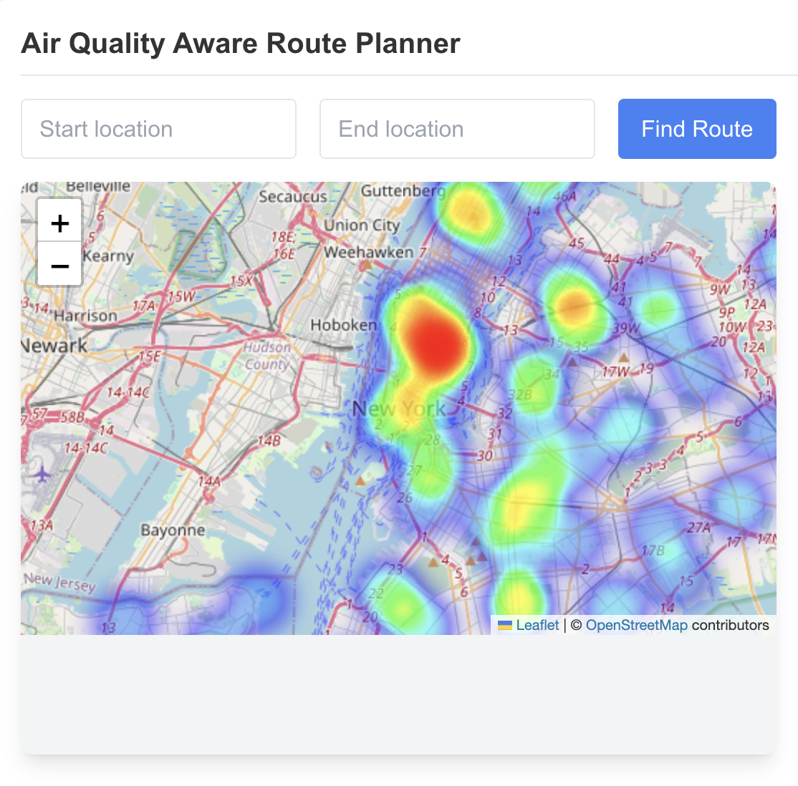
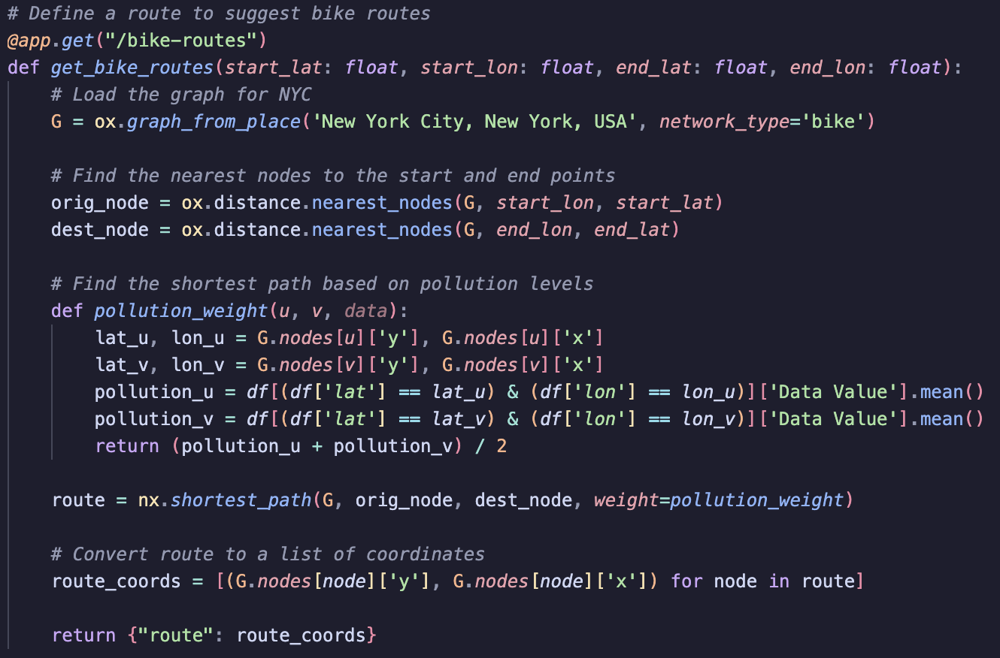

# AI Climate Hackathon Project

## Overview

This project is a web application that visualizes pollution levels in New York City (NYC) and provides a service to optimize bike routes to minimize exposure to pollution. The application is built using FastAPI for the backend and React for the frontend.

## Features

1. **Pollution Visualization**: The app displays a heatmap of pollution levels in NYC, allowing users to see areas with high and low pollution.
2. **Route Optimization**: The app provides an optimized bike route that minimizes exposure to pollution based on real-time pollution data.

## Installation

### Backend

1. **Create Conda Environment**: Create a Conda environment using the provided `environment.yml` file.

    ```sh
    conda env create -f environment.yml
    ```

2. **Activate Environment**: Activate the Conda environment.

    ```sh
    conda activate ai_climate_hackathon
    ```

3. **Run FastAPI Server**: Navigate to the backend directory and run the FastAPI server.

    ```sh
    cd backend
    uvicorn main:app --reload
    ```

### Frontend

1. **Navigate to Frontend Directory**: Navigate to the frontend directory.

    ```sh
    cd ../air-quality-route-planner
    ```

2. **Install Dependencies**: Install the necessary dependencies using npm or yarn.

    ```sh
    npm install
    ```

3. **Run React App**: Start the React development server.

    ```sh
    npm start
    ```

## Usage

### Pollution Visualization

The app displays a heatmap of pollution levels in NYC. The heatmap is generated using the `folium` library and is based on real-time pollution data.

### Route Optimization

The app provides an optimized bike route that minimizes exposure to pollution. Users can input their start and end locations, and the app will calculate the route with the least pollution exposure using the `osmnx` and `networkx` libraries.

## API Endpoints

### Health Check

- **Endpoint**: `/health`
- **Method**: GET
- **Description**: Returns the status of the server.

### Fetch Data

- **Endpoint**: `/data`
- **Method**: GET
- **Description**: Returns the pollution data.

### Generate Heatmap

- **Endpoint**: `/heatmap`
- **Method**: GET
- **Description**: Returns the HTML content of the pollution heatmap.

### Suggest Bike Routes

- **Endpoint**: `/bike-routes`
- **Method**: GET
- **Parameters**:
  - `start_lat` (float): Starting latitude.
  - `start_lon` (float): Starting longitude.
  - `end_lat` (float): Ending latitude.
  - `end_lon` (float): Ending longitude.
- **Description**: Returns an optimized bike route that minimizes exposure to pollution.

## Screenshots

### Pollution Heatmap



### Route Optimization 



